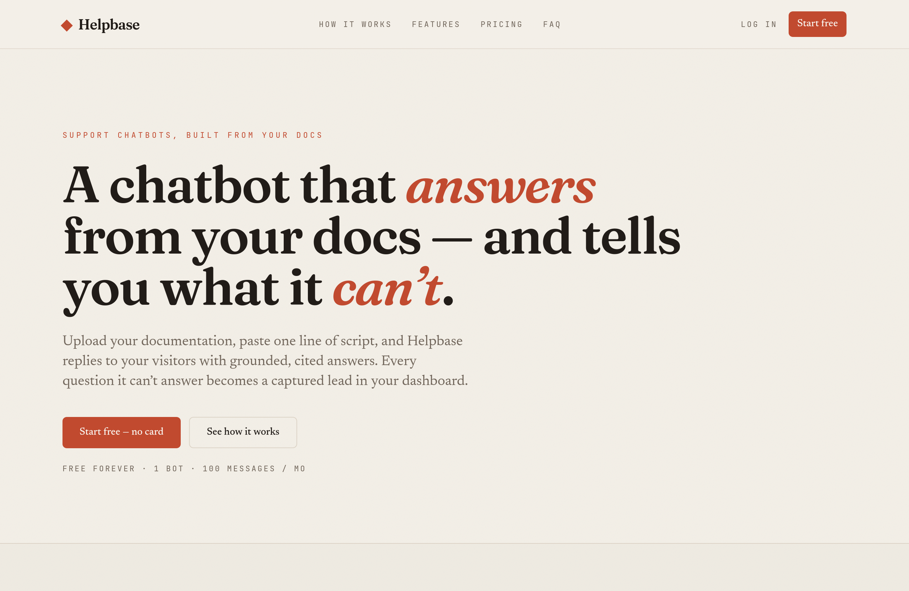
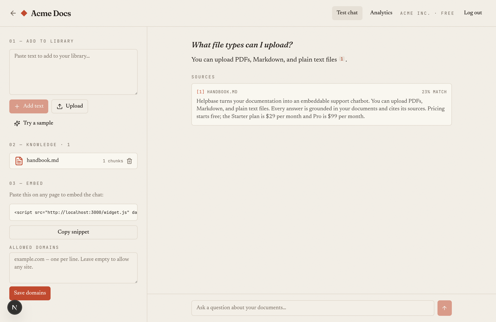
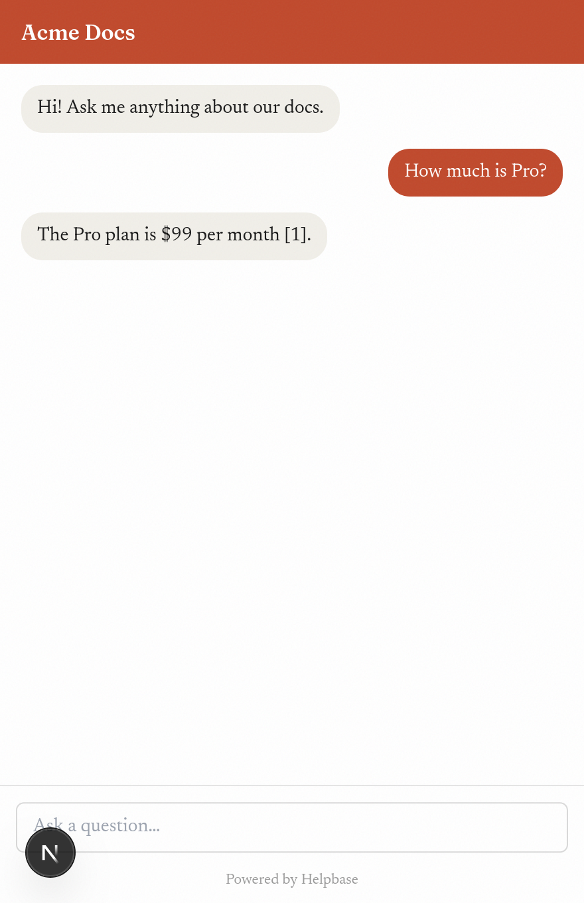
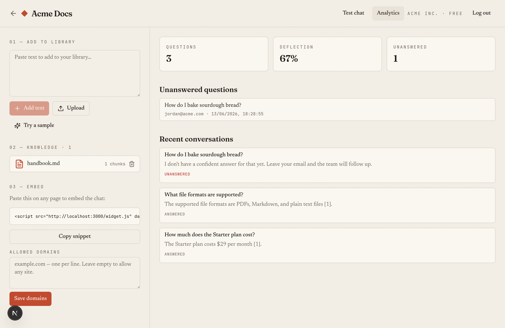
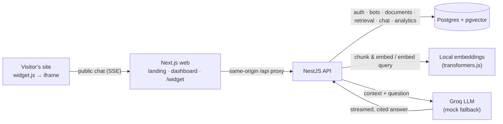

# Helpbase

> Turn your documentation into an **embeddable support chatbot** — one that answers visitors
> with grounded, cited replies, and **captures the questions it can’t answer** as leads.
>
> A production-shaped, multi-tenant SaaS MVP. Next.js + NestJS + pgvector + local embeddings + Groq.




## What it does

Sign up, create a bot, upload your docs, and drop **one line of script** on your site:

```html
<script src="https://YOUR-APP/widget.js" data-bot="pub_xxxxxxxx" defer></script>
```

A chat launcher appears in a style-isolated iframe. Visitors ask questions and get answers
**built only from your documents, footnoted to the source**. When the best match isn’t
confident enough, the bot says so and **captures the question — plus the visitor’s email —**
so your team can follow up. Every conversation, and every gap in your docs, shows up in a
per-bot analytics dashboard.

> **Deflect what you can. Capture what you can’t.**

| In the dashboard | On the visitor’s site |
| --- | --- |
|  |  |

The **analytics** make the loop concrete — deflection rate, the questions your docs don’t
cover, and the emails left behind:



## Why it’s interesting (engineering signals)

- **Multi-tenant from the ground up** — accounts, JWT (Passport, httpOnly cookie), and a
  `BotOwnerGuard` so a bot only ever retrieves its own corpus. Tenant + bot isolation is
  enforced in the pgvector query and covered by e2e tests.
- **Real RAG pipeline** — chunking, local embeddings, cosine search, context assembly, and
  grounded generation with inline citations. A retrieval-confidence gate decides when to
  answer vs. deflect.
- **A genuinely embeddable widget** — a tiny vanilla loader + an isolated iframe + an
  unauthenticated, origin-checked, rate-limited public chat endpoint. Streams over SSE.
- **The product, not just the demo** — landing page (SSR + SEO: metadata, sitemap, robots,
  JSON-LD), signup/login, a dashboard, lead capture, and analytics.
- **Local-first embeddings** (`transformers.js`, `all-MiniLM-L6-v2`) — no embedding API, no
  cost, offline. Groq for generation, with a **mock fallback** so tests/CI run without a key.
- **Typed throughout** (strict TS, no `any`), tested (58 unit + 28 e2e), linted, CI on every PR.

## Golden path

1. Sign up → land in the dashboard at `/app`.
2. Create a bot and upload docs (paste, or drop a PDF / `.md` / `.txt`).
3. Copy the embed snippet onto any page (try `examples/embed-demo.html`).
4. Ask a question on that page → a streamed, cited answer.
5. Ask something your docs don’t cover → the bot offers to take your email.
6. Watch the conversation — and any unanswered question — appear in **Analytics**.

## Architecture



The web app talks to the API **same-origin** (Next rewrites `/api/*` to the API) so the
httpOnly auth cookie stays first-party. The embeddable widget calls a separate **public**,
origin-checked, rate-limited endpoint keyed by a bot’s public key.

## Quickstart

```bash
cp .env.example .env          # add a free GROQ_API_KEY for real answers; set JWT_SECRET
docker compose up             # builds & runs postgres + api + web
# 5432 taken? →  POSTGRES_PORT=5433 docker compose up

# open http://localhost:3000
```

Get a free key at <https://console.groq.com>. Without `GROQ_API_KEY`, embeddings and retrieval
still run and a **mock LLM** answers from the retrieved chunks — enough to see the flow (and
what tests/CI use). `JWT_SECRET` is required; the compose ships a dev default you should
override.

### Run locally without Docker

```bash
pnpm install
POSTGRES_PORT=5433 docker compose up -d postgres   # or any Postgres 16 with pgvector
pnpm --filter api prisma:migrate
pnpm --filter api dev                              # http://localhost:4000
pnpm --filter web dev                              # http://localhost:3000
```

## Tech stack

| Layer        | Choice                                                                   |
| ------------ | ------------------------------------------------------------------------ |
| Frontend     | Next.js (App Router), React 19, TypeScript, Tailwind CSS                 |
| Backend      | NestJS 11, Prisma 6, TypeScript                                          |
| Auth         | Passport (`passport-local` + `passport-jwt`), httpOnly cookie, bcryptjs  |
| Embeddings   | `@xenova/transformers` — `all-MiniLM-L6-v2` (384-dim), local, no key     |
| Vector DB    | Postgres 16 + `pgvector` (cosine `<=>` via `$queryRaw`)                  |
| LLM          | Groq (`llama-3.3-70b-versatile`) with a mock fallback                    |
| Widget       | Vanilla `widget.js` loader + isolated iframe; SSE; `@nestjs/throttler`   |
| Validation   | Zod via `nestjs-zod`                                                      |
| Tooling      | pnpm workspaces, Docker Compose, GitHub Actions, ESLint + Prettier       |

## Project layout

```
rag-doc-qa/                      # repo name; the product is “Helpbase”
├── apps/
│   ├── api/   # NestJS: auth · bots · documents · retrieval · chat · public · conversations
│   └── web/   # Next.js: landing (/) · dashboard (/app) · embeddable widget (/widget)
├── examples/embed-demo.html     # standalone page proving off-app embedding
├── docker-compose.yml
└── .github/workflows/ci.yml
```

## Design notes

- **Same-origin auth.** Cross-origin `SameSite=Lax` cookies don’t work on localhost, so the
  web proxies `/api/*` to the API rather than calling it cross-origin — first-party cookie,
  unbuffered SSE.
- **Confidence gate.** A cosine-score threshold decides answer vs. deflect; the value is tuned
  for `all-MiniLM-L6-v2` and lives in one place (`retrieval/confidence.ts`).
- **Best-effort embed allowlist.** A public embed key is inherently visible, so the domain
  allowlist gates casual abuse rather than being a hard secret.

### Deferred (post-MVP)

- **Billing & gating** — Stripe test-mode checkout + usage metering to enforce the plan limits
  shown on the pricing page (which is currently illustrative).
- Team seats / invites, email verification + password reset, URL/sitemap ingestion, OCR.

## License

MIT
