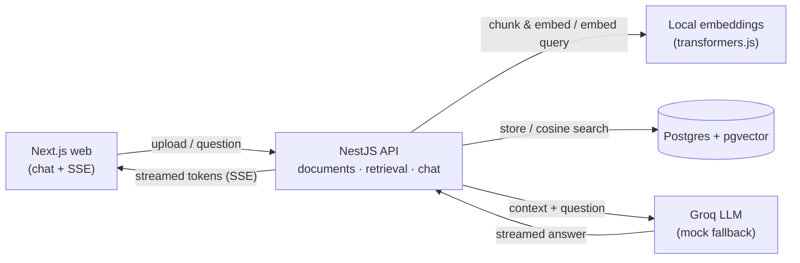

# RAG Doc Q&A

> Upload your documents, ask questions, get **streamed answers with inline citations**.
> A production-shaped Retrieval-Augmented Generation app — Next.js + NestJS + Groq.


<!-- TODO: replace with a real demo GIF once the UI is built -->
<!--  -->

## What it does

1. **Ingest** — paste text or drop in PDFs / `.txt` / `.md`. The API extracts text, splits it
   into overlapping chunks, embeds each chunk, and stores the vectors in Postgres (pgvector).
2. **Retrieve** — your question is embedded and matched against the corpus via cosine
   similarity to pull the most relevant chunks.
3. **Generate** — retrieved context + question go to a Groq-hosted LLM, which streams an
   answer back token-by-token, with **citations** pointing at the exact source chunks.

Runs end-to-end with **one command**. Embeddings run **locally** (no key needed); real
answers need a **free Groq API key**. Without one, a mock LLM answers from the retrieved
chunks so the pipeline still runs (also what tests/CI use — no external calls, no secrets).

## Why it's interesting (engineering signals)

- **Real RAG pipeline**: chunking strategy, embeddings, vector search, context assembly,
  grounded generation with citations — not a thin "call the LLM" wrapper.
- **Local-first embeddings** via `transformers.js` (`all-MiniLM-L6-v2`) — no embedding API,
  no cost, runs offline. The LLM provider is pluggable: **Groq** for real answers (free tier),
  with a mock fallback so tests/CI run without secrets or external calls.
- **Streaming** end-to-end (Server-Sent Events → React).
- **Typed throughout** (strict TypeScript, no `any`), tested, linted, CI on every push.
- **One-command run**: `docker compose up`.

## Architecture



## Tech stack

| Layer       | Choice                                                       |
| ----------- | ------------------------------------------------------------ |
| Frontend    | Next.js (App Router), React, TypeScript, Tailwind CSS        |
| Backend     | NestJS, Prisma, TypeScript                                   |
| Embeddings  | `@xenova/transformers` — `all-MiniLM-L6-v2` (384-dim)        |
| Vector DB   | Postgres 16 + `pgvector` (Prisma + raw SQL for `<=>`)        |
| LLM         | Groq (`groq-sdk`) — Llama 3.3 70B, with mock fallback        |
| Validation  | Zod via `nestjs-zod`                                         |
| Transport   | Server-Sent Events for token streaming                       |
| Tooling     | pnpm workspaces, Docker Compose, GitHub Actions, ESLint      |

## Quickstart

```bash
# 1. clone, then:
cp .env.example .env          # add your free GROQ_API_KEY for real answers
docker compose up             # starts postgres, api, web

# open http://localhost:3000
```

Get a free key at <https://console.groq.com>. If `GROQ_API_KEY` is unset, embeddings and
retrieval still run, and a mock LLM answers **from the retrieved chunks** — enough to see the
flow, but add a key for genuine generation. (Tests and CI run in this mock mode by design.)

### Run locally without Docker

```bash
pnpm install
pnpm --filter api dev         # http://localhost:4000
pnpm --filter web dev         # http://localhost:3000
```

## Project layout

```
rag-doc-qa/
├── apps/
│   ├── api/        # NestJS: documents, embeddings, retrieval, chat
│   └── web/        # Next.js: add-content + chat UI with streaming & citations
├── docker-compose.yml
├── .github/workflows/ci.yml
└── README.md
```

## Roadmap / out of scope (v1)

OCR for scanned PDFs · document management/delete · multi-turn chat · hybrid search · auth ·
observability · rate limiting · deployed demo link.

## License

MIT
